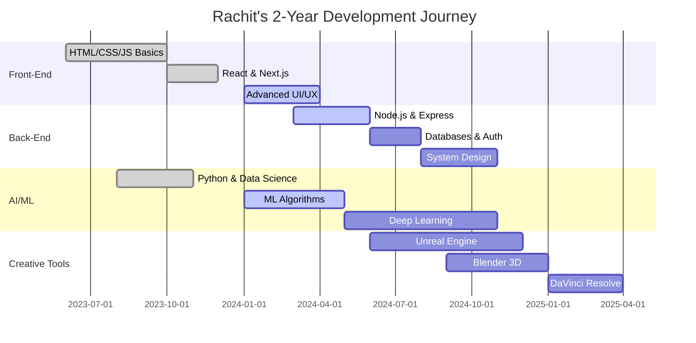

# 🚀 INITIALIZING DEVELOPER PROFILE...


[](https://git.io/typing-svg)


```diff
@@                    SYSTEM STATUS: ONLINE                    @@
+ Age: 16 | Location: Kathmandu, Nepal | Status: Building the Future
! Mission: Become World-Class Software Engineer in 2 Years
# Currently: Developing Project Nexus - AI-Powered Web Application
```


</div>

---

<div align="center">

## 🎯 LOADING PROFILE DATA...


</div>

```python
class RachitBhatta:
    def __init__(self):
        self.name = "Rachit Bhatta"
        self.age = 16
        self.role = "Full-Stack Developer & AI Enthusiast"
        self.location = "Kathmandu, Nepal 🇳🇵"
        self.mission = "Building AI-powered systems that solve real problems"
        
    def about_me(self):
        return """
        16-year-old developer with a passion for building impactful projects.
        I learn by DOING - theory follows practice, not vice versa.
        Currently managing 5 technical domains while excelling in academics.
        
        Philosophy: "Learning by building. Failing fast. Iterating faster."
        """
```

<div align="center">


---

## ⚡ SKILL MATRIX LOADING...


</div>

### 🔥 **PRIMARY TECH STACK**

<table align="center">
<tr>
<td width="50%" valign="top">

#### **💻 FRONT-END**


**Status:** `████████████████████░░░░░` **85%**

</td>
<td width="50%" valign="top">

#### **⚙️ BACK-END**


**Status:** `████████████████░░░░░░░░░` **65%**

</td>
</tr>

<tr>
<td width="50%" valign="top">

#### **🤖 AI/ML**


**Status:** `████████████████░░░░░░░░░` **60%**

</td>
<td width="50%" valign="top">

#### **🛠️ TOOLS & WORKFLOW**


**Status:** `████████████████████░░░░░` **80%**

</td>
</tr>
</table>

<div align="center">


---

## 📊 ANALYZING GITHUB STATISTICS...


---

## 🚀 FLAGSHIP PROJECT: NEXUS


</div>

<table align="center">
<tr>
<td width="60%">

### **🎯 PROJECT OVERVIEW**

**Nexus** is my flagship AI-powered web application that showcases full-stack development capabilities combined with intelligent features.

#### **✨ KEY FEATURES**
- 🚀 **Next.js** framework for optimal performance
- ⚛️ **React** component architecture
- 🤖 **AI/ML** integration for smart functionality
- 🔐 **Secure** authentication & API design
- 📱 **Responsive** design for all devices
- ⚡ **Real-time** updates and interactions

#### **🛠️ TECH STACK**
```yaml
Frontend: Next.js, React, Tailwind CSS
Backend:  Node.js, Express.js, REST APIs
AI/ML:    Python, TensorFlow, NumPy
Tools:    Git, VS Code, Figma
```

</td>
<td width="40%">


#### **📈 PROGRESS**

```
Planning        ████████████ 100%
Design          ████████████ 100%
Development     ████████░░░░  80%
Testing         ████░░░░░░░░  40%
Deployment      ██░░░░░░░░░░  20%
```

#### **🎯 STATUS**
```diff
+ Backend API: Functional
+ Frontend UI: 80% Complete
! AI Integration: In Progress
- Testing Phase: Upcoming
```

</td>
</tr>
</table>

<div align="center">


---

## 🎓 DUAL TRACK: ACADEMICS + DEVELOPMENT


</div>

<table align="center">
<tr>
<td width="50%" align="center">

### **📚 CLASS 11 ACADEMICS**


#### **SUBJECTS**
🔬 **Physics** - Mechanics, Thermodynamics  
🧪 **Chemistry** - Atomic Structure, Bonding  
📐 **Mathematics** - Calculus, Algebra  

#### **APPROACH**
✅ Active Recall  
✅ Spaced Repetition  
✅ Daily Practice  

**Performance:** `██████████████████████░░` **90%**

</td>
<td width="50%" align="center">

### **💻 TECHNICAL LEARNING**


#### **DOMAINS**
🌐 **Full-Stack Development**  
🤖 **AI/ML Engineering**  
🎮 **Unreal Engine**  
🎨 **Blender 3D**  
🎬 **DaVinci Resolve**  

#### **METHOD**
✅ Project-First Learning  
✅ Build Real Applications  
✅ Industry-Focused  

**Progress:** `████████████████░░░░░░░░` **64%**

</td>
</tr>
</table>

<div align="center">


---

## 🗺️ 2-YEAR MASTERY ROADMAP


</div>



<div align="center">


---

## 💎 WHAT MAKES ME DIFFERENT

</div>

<table align="center">
<tr>
<td align="center" width="25%">


### ⚡ **Fast Learner**
Rapidly absorbs and applies new concepts through hands-on projects

</td>
<td align="center" width="25%">


### 🚀 **Project-First**
Builds real applications that solve actual problems, not toy projects

</td>
<td align="center" width="25%">


### 🎯 **Multi-Domain**
Balancing 5 technical domains simultaneously with academics

</td>
<td align="center" width="25%">


### 💪 **Self-Driven**
Managing 2-year roadmap independently with clear goals

</td>
</tr>
</table>

<div align="center">


---

## 🎯 CAREER GOALS

</div>

<table align="center">
<tr>
<td width="50%">

### **🎯 SHORT-TERM (6-12 Months)**


<br>

- ✅ Complete **5+ production-ready** full-stack projects
- ✅ Master **AI/ML** with deployed models
- ✅ Build **impressive portfolio** website
- ✅ Contribute to **open-source** projects
- ✅ Develop **2 mobile applications**

<br clear="left"/>

</td>
<td width="50%">

### **🚀 LONG-TERM (2 Years)**


<br>

- 🎯 **Full-Stack + AI/ML + Creative Tools** mastery
- 🎯 Build **large-scale apps** with real users
- 🎯 Excel in **Class 12** while growing technically
- 🎯 **Top university** admission or **startup** opportunity
- 🎯 **Industry-ready** for tech companies

<br clear="left"/>

</td>
</tr>
</table>

<div align="center">


---

## 💡 DEVELOPER PHILOSOPHY


</div>

```python
class MyPhilosophy:
    def __init__(self):
        self.motto = "Learning by building. Failing fast. Iterating faster."
        self.approach = "Project-First Learning"
        self.mindset = "Always Be Building"
    
    def daily_routine(self):
        return {
            "morning": "Class 11 Academics + Active Recall",
            "afternoon": "Deep Work on Projects (4+ hours)",
            "evening": "Learning New Tech + Building",
            "night": "Creative Tools + Portfolio Work"
        }
    
    def belief(self):
        return """
        I don't just learn technologies—I MASTER them through real projects.
        Every line of code brings me closer to becoming a world-class engineer
        who builds AI-powered systems that solve real problems.
        """
```

<div align="center">


---

## 📈 WEEKLY CODING ACTIVITY

<!--START_SECTION:waka-->
<!--END_SECTION:waka-->


---

## 🏆 ACHIEVEMENTS UNLOCKED

</div>

<p align="center">
  
</p>

<div align="center">

| Achievement | Status | Description |
|------------|--------|-------------|
| 🎯 Project Nexus | `In Progress` | AI-powered web application |
| 🚀 React Mastery | `✅ Complete` | Hooks, State, Components |
| 💻 5+ Projects | `✅ Complete` | Full-stack applications |
| 🤖 AI/ML Basics | `✅ Complete` | NumPy, Matplotlib, Python |
| 📚 Academic Excellence | `✅ Ongoing` | Class 11 - 90%+ average |
| ⚡ Multi-Domain | `✅ Active` | 5 domains simultaneously |


---

## 📫 CONNECT WITH ME


<br>

[](mailto:rachit.bhatta@example.com)
[](https://github.com/rachitbhatta)
[](https://rachitbhatta.dev)
[](https://linkedin.com/in/rachitbhatta)
[](https://twitter.com/rachitbhatta)

<br>

```javascript
const rachit = {
  location: "Kathmandu, Nepal 🇳🇵",
  currentFocus: "Project Nexus + AI/ML Mastery",
  availableFor: "Collaboration on innovative projects",
  funFact: "Building the future one commit at a time! 🚀"
};

console.log("Let's build something amazing together! 💻");
```


---

## 🔥 CURRENT STATUS

</div>

```yaml
🔭 Currently working on: Project Nexus - AI-powered web application
🌱 Currently learning: Advanced AI/ML algorithms, System Design, Microservices
👯 Looking to collaborate on: Open-source projects, AI/ML applications
🤔 Seeking help with: Deep Learning optimization, Cloud deployment
💬 Ask me about: Full-Stack Development, Python, React, Next.js, AI/ML
📫 How to reach me: rachit.bhatta@example.com
⚡ Fun fact: Managing 5 technical domains + Class 11 academics at age 16!
```

<div align="center">


---

## 🎨 CONTRIBUTION SNAKE

<picture>
  <source media="(prefers-color-scheme: dark)" srcset="https://raw.githubusercontent.com/rachitbhatta/rachitbhatta/output/github-contribution-grid-snake-dark.svg">
  <source media="(prefers-color-scheme: light)" srcset="https://raw.githubusercontent.com/rachitbhatta/rachitbhatta/output/github-contribution-grid-snake.svg">
  
</picture>


---

## 📊 DETAILED STATS

<details>
<summary>📈 Click to expand detailed statistics</summary>

<br>


</details>


---


### 💭 QUOTE OF THE DAY


---


<h2 align="center">✨ "The best way to predict the future is to build it." ✨</h2>

<h3 align="center">Made with 💻 and ☕ by Rachit Bhatta</h3>

<p align="center">
  
  
  
</p>


</div>
